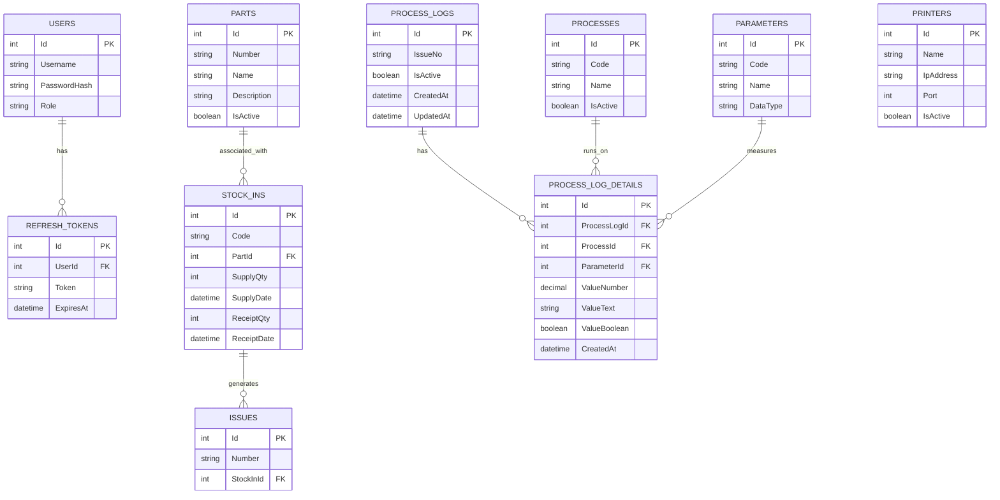

# Product Requirement Document (PRD)
## Sistem Backend Traceability Produksi PT Tokyo Radiator Selamat Sempurna (TRSS)

---

## 1. Pendahuluan & Ringkasan Dokumen
Dokumen Persyaratan Produk (PRD) ini menjelaskan spesifikasi, fitur, dan kebutuhan teknis untuk sistem **Backend Traceability** PT Tokyo Radiator Selamat Sempurna (TRSS). Sistem ini dirancang untuk mencatat, melacak, dan memantau seluruh alur proses produksi komponen otomotif secara real-time guna menjamin standar kualitas (QA) serta mempermudah penelusuran jika terjadi defect/issue produk.

---

## 2. Tujuan & Target Pengguna
### 2.1 Tujuan Sistem
*   **Traceability Secara Atomik**: Melacak seluruh riwayat proses manufaktur per produk berdasarkan kode unik/serial number (Issue Number).
*   **Integrasi Cepat dengan IoT/HMI**: Mendukung penerimaan data berkecepatan tinggi langsung dari mesin/HMI melalui database transaction yang aman.
*   **Alerting Real-Time**: Mendeteksi secara instan jika printer thermal pencetak label offline di lini produksi.
*   **Manajemen Data Master & Transaksi**: Mengelola data printer, komponen (parts), proses produksi, parameter pengetesan, serta transaksi stock-in material.

### 2.2 Target Pengguna
*   **Operator Mesin & IoT/HMI**: Mengirim data pengukuran/pengetesan produk langsung dari lini perakitan.
*   **Supervisor / Quality Assurance (QA)**: Menganalisis log produksi, performa OK/NG, dan menelusuri riwayat (traceback) jika ditemukan barang defect.
*   **System Administrator**: Mengonfigurasi master data (user, part, process, parameter, printer) dan memantau status perangkat keras.

---

## 3. Arsitektur & Teknologi Acuan
*   **Bahasa Pemrograman**: C# (.NET 10)
*   **Gaya Arsitektur**: **Clean Architecture / Onion Architecture**
    *   `Domain`: Model bisnis murni, entity, dan abstraksi interface repository.
    *   `Application`: Kontrak use case, service logic, DTO, mapper, dan validasi data.
    *   `Infrastructure`: Akses database (Entity Framework Core dengan Pomelo MySQL), integrasi external printer SDK, dan logic networking (TCP connection).
    *   `API`: Controller Web API, endpoint routing, middleware exception handling, dan SignalR Hub.
    *   `Shared`: Utility, helper respons API format standar, exception model.
*   **Database**: MySQL 8.0+

---

## 4. Persyaratan Fungsional (Fitur Backend)

### 4.1 Modul Autentikasi & Otorisasi (`Auth`)
*   **Pola Akses**: Berbasis token JWT (JSON Web Token).
*   **Fitur**:
    *   Login menggunakan username & password.
    *   Penerbitan Access Token (short-lived) dan Refresh Token (long-lived) untuk perpanjangan session otomatis.
    *   Registrasi dan manajemen akun user.

### 4.2 Modul Dashboard & Analytics (`Dashboard`)
*   **Deskripsi**: Menyediakan data agregat produksi untuk visualisasi di aplikasi Frontend.
*   **Endpoint Utama**:
    *   `GET /api/dashboard/summary`: Menghitung total output produksi (Total, Hari ini, Bulan ini) serta rasio perbandingan status OK/NG.
    *   `GET /api/dashboard/stats`: Menyediakan data tren output produksi 7 hari terakhir, distribusi OK/NG, dan daftar komponen teratas (Top Parts) yang diproduksi.
    *   `GET /api/dashboard/recent-logs`: Menampilkan log aktivitas produksi terbaru (default limit 5 data).

### 4.3 Modul Master Data Management (CRUD)
Sistem backend menyediakan fungsionalitas CRUD (Create, Read, Update, Delete) generik untuk entitas-entitas berikut:
*   **Parts (Komponen)**: Nomor part, nama part, deskripsi, dan status aktif.
*   **Processes (Proses Produksi)**: Kode proses (misal: PRC-005), nama proses, dan status aktif.
*   **Parameters (Parameter Tes)**: Kode parameter (misal: PRM-002), nama parameter (misal: Pressure), satuan, tipe data (numeric, text, atau boolean).
*   **Printers (Printer Label)**: Nama printer, alamat IP, port (default 9100), dan status koneksi fisik.

### 4.4 Modul Stock-In & Label Printing (`StockIn`)
*   **Deskripsi**: Mencatat penerimaan bahan baku atau komponen setengah jadi dan memfasilitasi pencetakan label tracking.
*   **Fitur**:
    *   Pencatatan transaksi Stock-In (tanggal supply, tanggal terima, kuantitas supply, kuantitas terima).
    *   **Pencetakan Label Menggunakan SDK**: Mengintegrasikan *Zebra Link-OS SDK* untuk mengirimkan payload ZPL (Zebra Printer Language) langsung ke printer thermal di jaringan pabrik.
    *   **Preview Label PDF**: Menghasilkan file PDF label stock-in berukuran **A5 Landscape** secara dinamis menggunakan *QuestPDF*.

### 4.5 Modul Real-Time Monitoring & WebSockets (`SignalR`)
*   **Deskripsi**: Memantau konektivitas hardware (printer) secara real-time.
*   **Fitur**:
    *   **Background Monitor Service**: Mengecek koneksi printer ke setiap IP & port terdaftar menggunakan koneksi TCP Client dengan timeout 2 detik. Loop berjalan otomatis setiap 10 detik.
    *   **Sinkronisasi Database**: Mengubah status `IsActive` di tabel printer secara otomatis berdasarkan konektivitas fisik.
    *   **SignalR Broadcast**: Hub `/hubs/printer` mengirimkan event `PrinterStatusUpdated` ke frontend hanya jika ada printer yang **Offline**. Jika semua online, broadcast tidak dikirim untuk menghemat bandwidth.

### 4.6 Modul Traceability Engine (Log Produksi)
*   **Deskripsi**: Mencatat proses perakitan dan pengetesan produk.
*   **Pola Entry Data (HMI / IoT)**: Menggunakan Stored Procedure MySQL `sp_insert_trace_data` untuk meminimalkan beban overhead API dan menjamin integritas data secara atomik.
*   **Aturan Bisnis Logika Traceability**:
    1.  **Issue Numbering**: Setiap produk dilacak menggunakan `IssueNo`.
    2.  **Penanganan NG (Not Good)**: Jika status aktif hasil produksi dikirim sebagai `NG (0)`, sistem otomatis menambahkan suffix `-R` (Rework/Repair) di belakang Issue Number (Contoh: `ISS-123` menjadi `ISS-123-R`).
    3.  **Atomicity**: Data disimpan dalam struktur transaksi database tunggal. Jika salah satu parameter tidak valid (misal parameter code tidak terdaftar), seluruh transaksi di-rollback.

---

## 5. Rancangan Basis Data & Struktur Entitas
Berikut adalah daftar tabel utama beserta relasinya:

---

## 6. Persyaratan Non-Fungsional
*   **Security (Keamanan)**:
    *   Enkripsi password menggunakan hashing aman (BCrypt / PBKDF2).
    *   Autentikasi Bearer JWT untuk semua endpoint API transaksi dan master data.
*   **Performance (Kinerja)**:
    *   HMI/IoT data logging terproses dalam waktu < 100 ms menggunakan SQL Stored Procedure.
    *   Koneksi pool database dikonfigurasi optimal untuk menangani write request secara paralel dari puluhan HMI mesin.
*   **Availability & Monitoring**:
    *   Sistem mencatat logs aplikasi secara terstruktur (Serilog) ke console dan file lokal harian dengan auto-rotate.
    *   Health checks untuk memastikan database MySQL dan hub printer dapat diakses dengan baik.
